# Brugervejledning

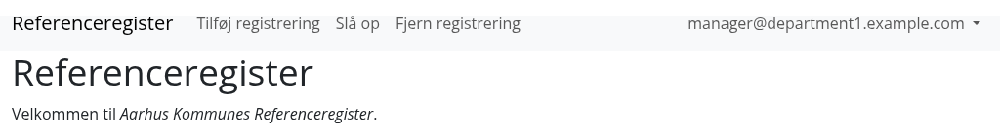

## Tilføj registrering

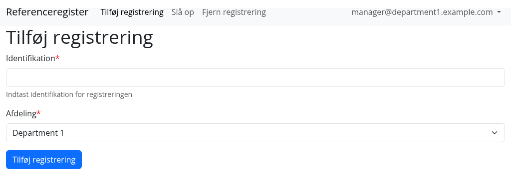

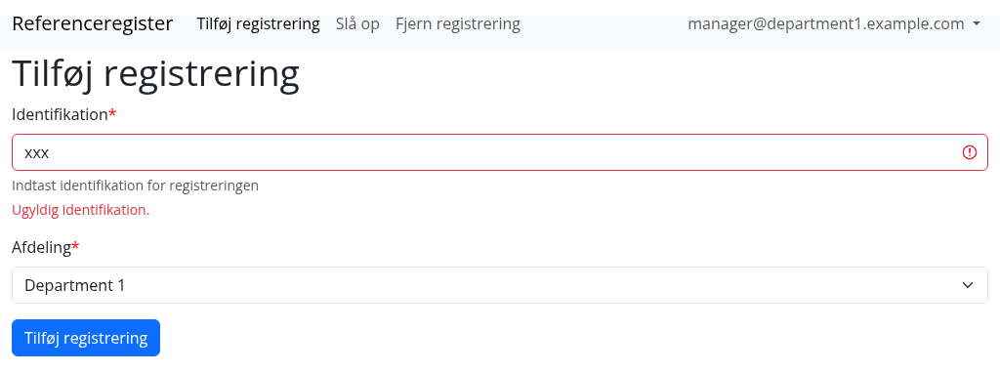

Systemet tjekker at identifikationen (id'et) er gyldig.

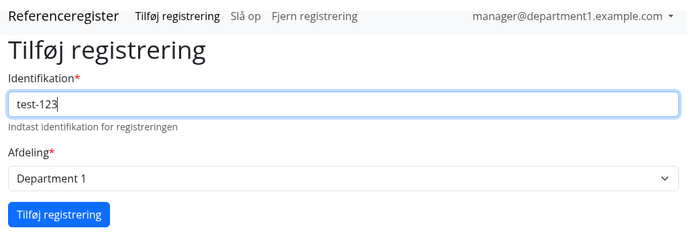
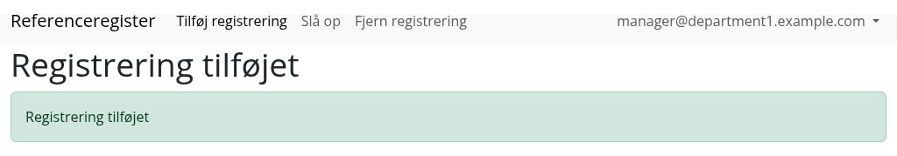

## Slå op

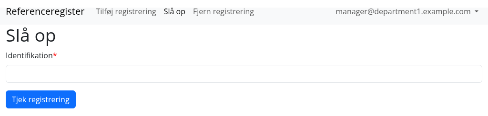

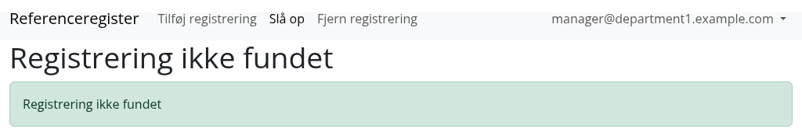
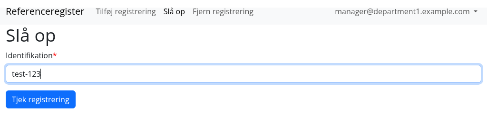
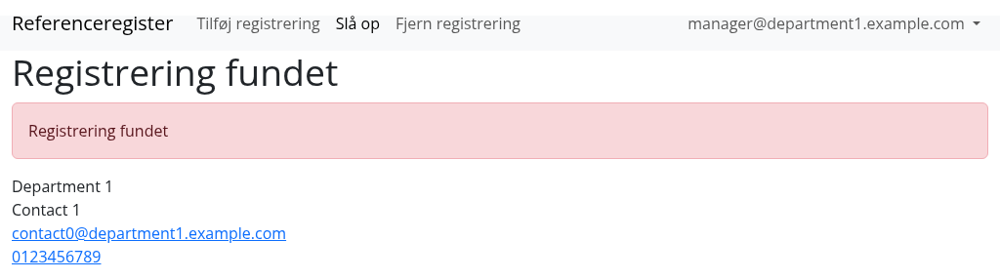

## Fjern registrering

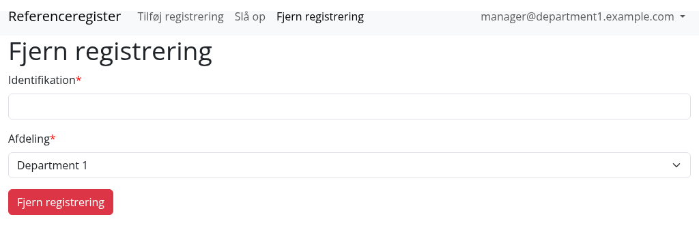
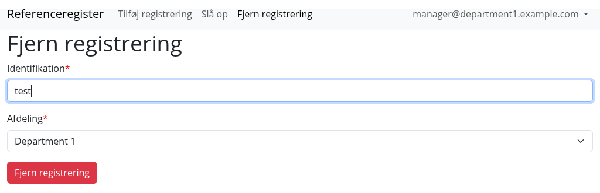
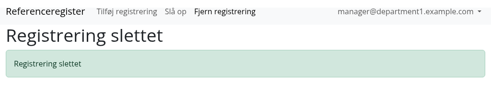

Bemærk at vi har fjernet en ikke-eksisterende registrering ("test").
