# Referenceregister

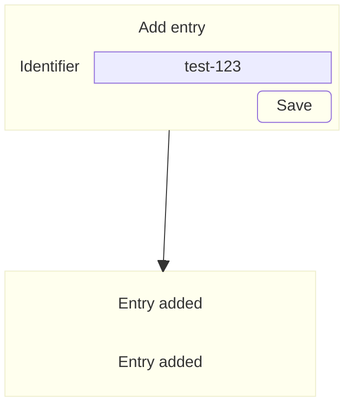
``` mermaid
---
config:
  # theme: forest
  # fontFamily: serif
---
block
  columns 1

  block:page_add_entry
    columns 4
    title_add_entry["Add entry"]:4
    label_identifier["Identifier"]         input_name["test-123"]:3
    space:3 button_save("Save")

    class title_add_entry title
    class label_identifier label
    class input_identifier input
    class button_save button
  end

  space

  block:page_entry_added
    columns 1
    title_entry_added["Entry added"]
    message_entry_added["Entry added"]

    class title_entry_added title
    class message_entry_added message_success
  end

  page_add_entry --> page_entry_added

  classDef title fill:none,stroke:none
  classDef message fill:none,stroke:none
  classDef message_success fill:none,stroke:none
  classDef label fill:none,stroke:none,label-position:right
  classDef input fill:none,label-position:left, label-padding: 5
  classDef button fill:none
```

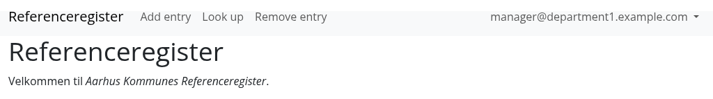

## Add entry

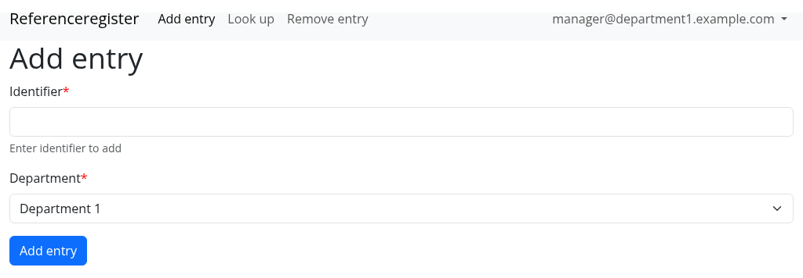

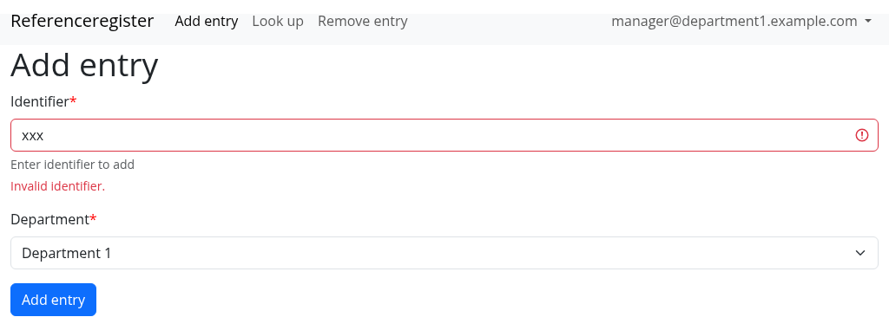
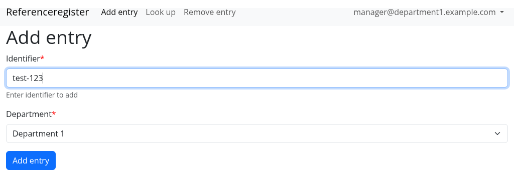
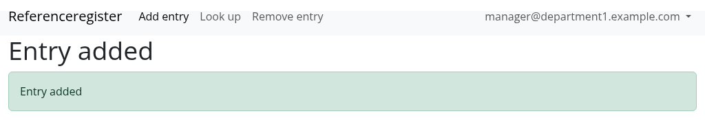

## Look up

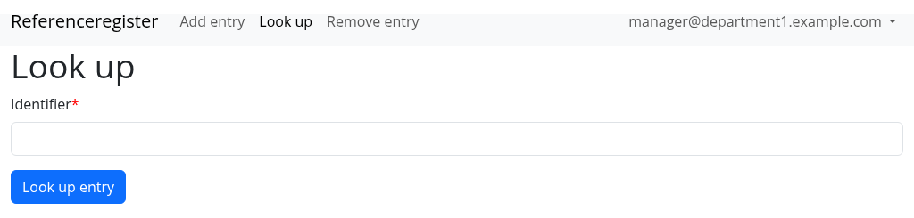
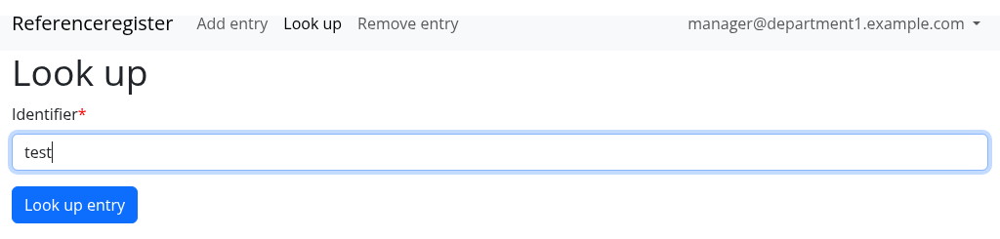
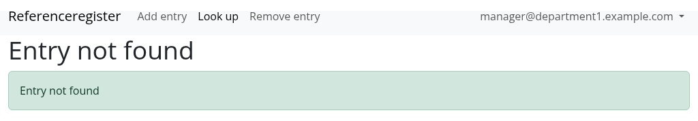

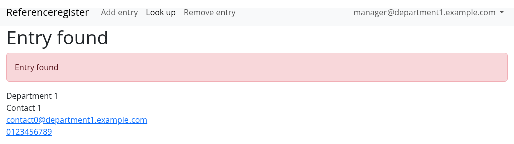

## Remove entry

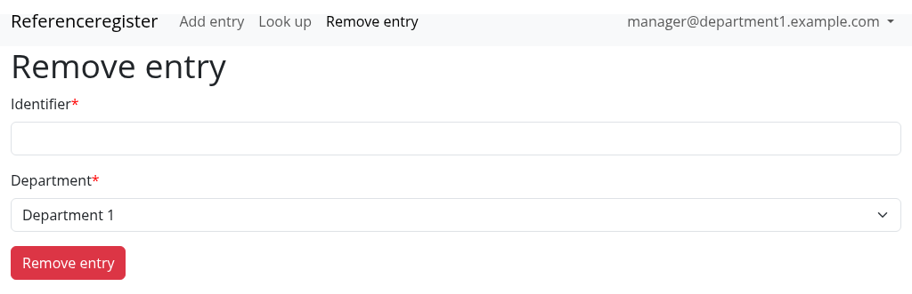
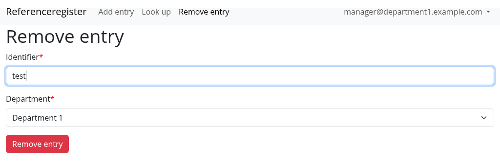
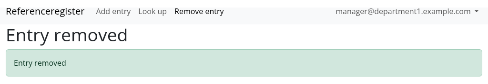

Note that we've "sucessfully" removed a non-existing entry ("test").
