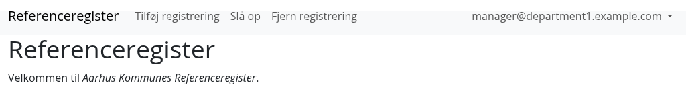
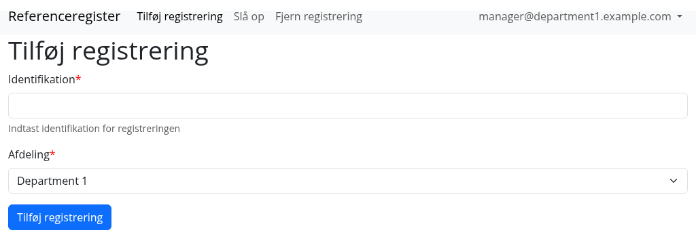
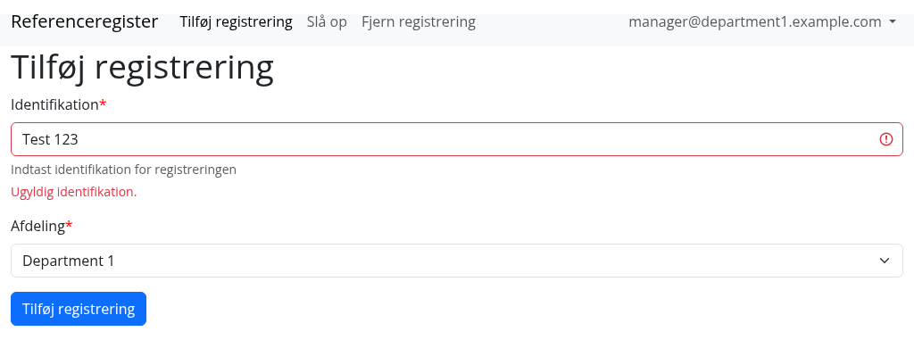
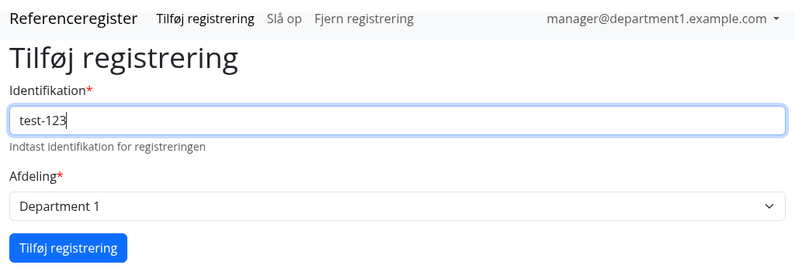
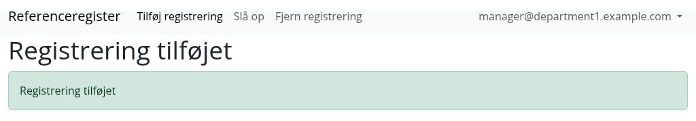
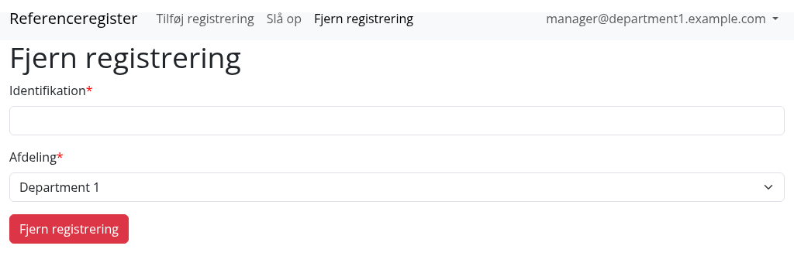
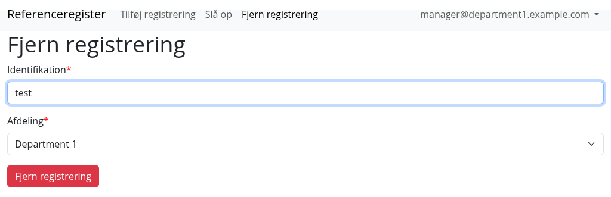
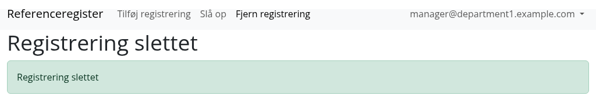

# Brugervejledning – leder

En leder kan – [ud over at lave opslag](../bruger/#opslag) – tilføje og fjerne registreringer.

## Tilføj registrering

Under <AppLink href="/add">Tilføj registrering</AppLink> kan en leder tilføje nye registreringer:

Systemet tjekker at identifikationen (id'et) er gyldig.

## Fjern registrering

En leder kan under <AppLink href="/remove">Fjern registrering</AppLink> fjerne registreringer:

::: info Obs!
Bemærk at systemet ikke tjekker om en registrering der slettes faktisk eksisterer, dvs. man får altid svaret
“Registrering slettet” uanset om der eksisterede en registrering eller ej.
:::
