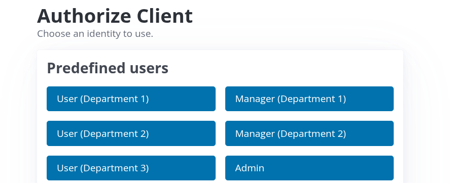

# Login

Login i Referenceregistret sker via “Medarbejderlogin” og adgang til systemet bestilles via
[Systemregistret](https://systemregister.azure.aarhuskommune.dk/AccessOnDemand).

Man kan anmode om rollerne "Leder" eller "Bruger".

## Test

I forbindelse med test bruger vi ikke rigtigt medarbejderlogin, men i stedet en række testbrugere der gør det muligt for
én person at teste som forskellige brugere med forskellige roller.

Ved at vælge en af mulighederne kan man teste som [*leder*](../leder/) ("Manager") eller [*bruger*](../bruger/)
("User") i forskellige afdelinger ("Department").

::: note Bemærk
"Admin" giver adgang til systemindstillinger og er en rolle der kun bruges i forbindelse med test.
:::
